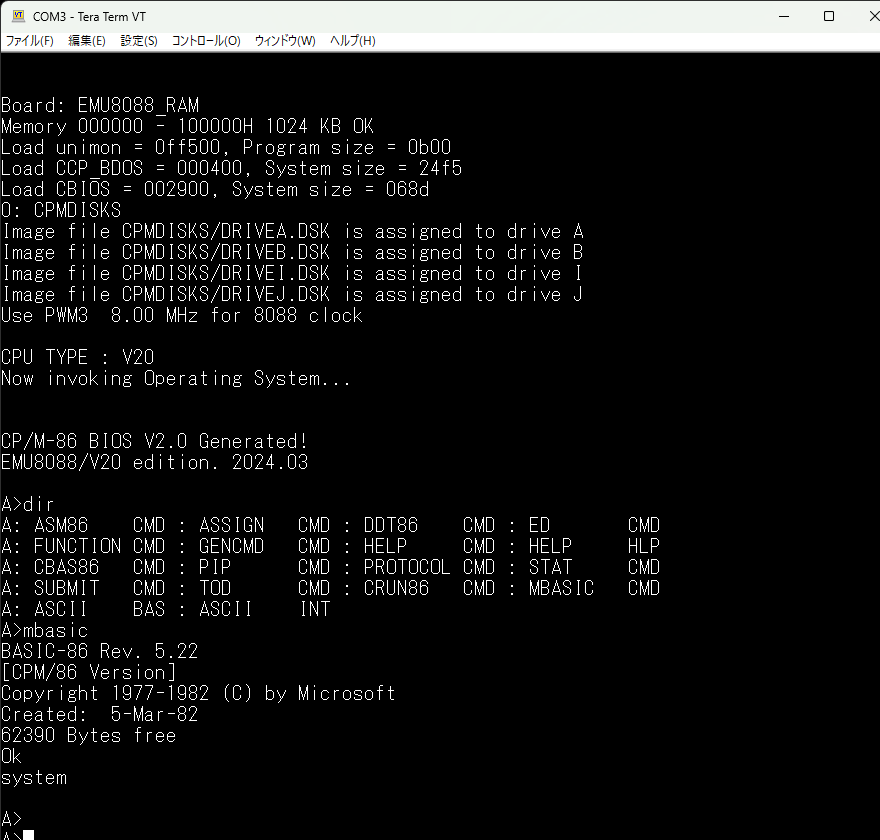

# EMU8088_57Q BIOS V2.0 CP/M-86 
 
MS-DOSを動かしているファームウェアの方式で、CP/M-86が動作するように 
PICのファームウェアと、CBIOSを更新しました。 
MS-DOSと同じように、8088/V20の８Mhz版に対応し、8Mhzで動作するようになります。 
 

# 2-29-2024 新規ソフト追加 
 
CP/M-86で動作する、以下の新規ソフトをDRIVEJに追加しました。 
1. GM88.CMD    : GAME言語（インタープリタ） 
2. TTBASIC.CMD : 豊四季タイニーBASIC（インタープリタ） 
3. VTL88.CMD   : Very Tiny Language（インタープリタ） 
 
電脳伝説さん（@vintagechips）のSBCV20で動かしていたものをCP/M-86で 
動作するようにコンバートしたものです。コンバートしただけで、新規機能 
はありません。（プログラムロードとかあれば便利なのでしょうけど^^;） 
詳細は以下を参照してください。 
https://github.com/akih-san/SBCV20_8088
 

# BIOS V2.0のCP/M-86起動画面 

SBCの詳細と、CP/M-86の詳細については、以下を参照してください。 
https://github.com/akih-san/EMU8088_57Q_CPM86

 
FWのソースのコンパイルは、マイクロチップ社の 
 
「MPLAB® X Integrated Development Environment (IDE)」 
 
を使っています。（MPLAB X IDE v6.10）コンパイラは、XC8を使用しています。 
https://www.microchip.com/en-us/tools-resources/develop/mplab-x-ide 
 
8088/V20用のアセンブラは、Macro Assembler AS V1.42を使用しています。 
http://john.ccac.rwth-aachen.de:8000/as/ 
 
FatFsはR0.15を使用しています。 
＜FatFs - Generic FAT Filesystem Module＞ 
http://elm-chan.org/fsw/ff/00index_e.html 
 
SDカード上のCP/Mイメージファイルの作成は、CpmtoolsGUIを利用しています。 
＜CpmtoolsGUI - neko Java Home Page＞ 
http://star.gmobb.jp/koji/cgi/wiki.cgi?page=CpmtoolsGUI 
 
 
＜＠hanyazouさんのソース＞ 
https://github.com/hanyazou/SuperMEZ80/tree/mez80ram-cpm 
 
 
＜@electrelicさんのユニバーサルモニタ＞ 
https://electrelic.com/electrelic/node/1317 
 
 
＜参考＞ 
・EMUZ80 
EUMZ80はZ80CPUとPIC18F47Q43のDIP40ピンIC2つで構成されるシンプルなコンピュータです。 
 
＜電脳伝説 - EMUZ80が完成＞   
https://vintagechips.wordpress.com/2022/03/05/emuz80_reference   
＜EMUZ80専用プリント基板 - オレンジピコショップ＞   
https://store.shopping.yahoo.co.jp/orangepicoshop/pico-a-051.html 
 
・SuperMEZ80 
SuperMEZ80は、EMUZ80にSRAMを追加し、Z80をノーウェイトで動かすことができるメザニンボードです 
 
SuperMEZ80 
https://github.com/satoshiokue/SuperMEZ80 
 
